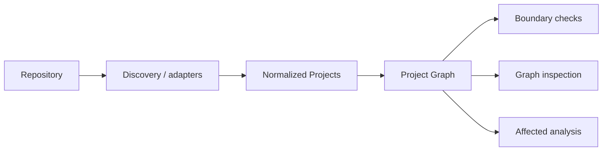

# Architecture Overview

ForgeRepo transforms repository structure into a normalized graph that higher-level features can analyze.

## Architectural layers

### Core

Owns ecosystem-neutral domain types and graph semantics.

### Adapters / discovery

Translate ecosystem-specific metadata and repository structure into normalized core concepts.

### Configuration

Loads and validates ForgeRepo configuration.

### Feature engines

Consume the Project Graph to perform boundary validation, affected analysis, and later repository intelligence.

### CLI

Wires commands, renders diagnostics, and maps results to exit codes.

## Key constraint

No higher-level feature should require re-parsing the repository into a separate model if the Project Graph can represent the required information.
