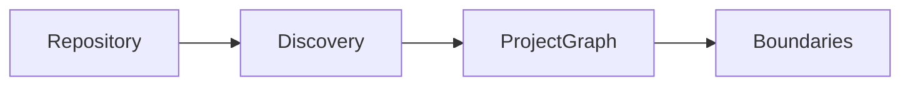

# Diagram Conventions

Prefer diagrams that remain reviewable as text.

## Preferred format

Use Mermaid inside Markdown when possible.

Example:



## When external diagram files are needed

Store editable sources under this directory and link them from the canonical Markdown document.

Avoid keeping architecture knowledge only in screenshots or exported images.

## Naming

Use descriptive names:

```text
project-graph-flow.md
boundary-evaluation.md
affected-analysis.md
```
